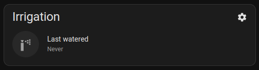

# Top Power Card

A custom card to show the top power consumption from a list of meters.



## Setup

We recommend using HACS:

[](https://my.home-assistant.io/redirect/hacs_repository/?owner=mancontr&repository=top-power-card&category=plugin)

## Configuration

To add the card into your panel, add a custom YAML card of type `custom:top-power-card`.

Example configuration:

```yml
type: custom:top-power-card
total: sensor.total_power
sections:
  - sensor.section1_power
  - sensor.section2_power
  - sensor.section3_power
limit: 5
idle_threshold: 5
high_threshold: 300

```

A comprehensive list of available options is provided below:

| Field          | Required | Description |
|----------------|----------|-------------|
| title          | No       | Card title override. |
| total          | Yes      | Sensor for total home consumption. |
| sections       | Yes      | Override the modal column titles. |
| limit          | No       | Max number of sections to show (or 0 for unlimited). |
| idle_threshold | No       | Minimum to consider a section as "idle" (grayed out). |
| high_threshold | No       | Minimum to consider a section as "high power usage" (highlighted). |
